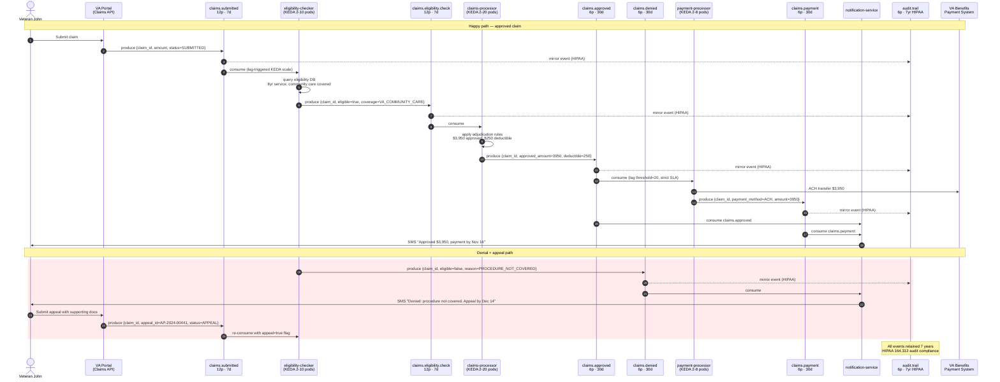
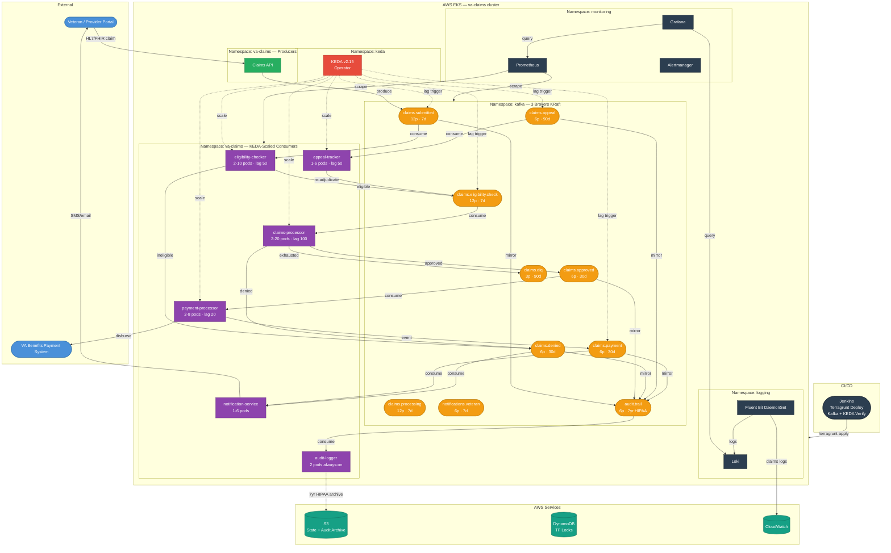

# VA Healthcare Claims — EKS + Confluent Kafka + KEDA CI/CD

Terragrunt-managed infrastructure for the **Veterans Affairs Health Insurance Claims** platform. Apache Kafka (KRaft mode via Helm) event-streams every claim from submission through eligibility, adjudication, payment, and HIPAA-compliant audit archival. KEDA auto-scales consumer deployments on EKS based on real-time Kafka lag.

> **Kafka pattern reference:** [kafka-zero-to-hero](https://github.com/iam-veeramalla/kafka-zero-to-hero) — KRaft mode, topic-per-event-type, consumer group patterns.

---

## The Problem: Veterans' Health Insurance Claims

The US Department of Veterans Affairs processes millions of health insurance claims per year. Before event streaming, the claims pipeline looked like this:

```
Veteran submits claim → batch job (nightly) → eligibility DB query → adjudication worker
→ payment batch (weekly) → notification email (next day)
```

**Real-world failures this caused:**
- Veterans waited weeks for claim decisions that should take hours
- Claims were lost when adjudication workers crashed mid-batch
- A single slow eligibility DB response blocked an entire batch of 50,000 claims
- Appeals had no visibility into current claim state — each system had its own siloed DB
- HIPAA audit logs were scattered across 12 different systems

### How Kafka Solves It

```
Veteran submits claim → claims.submitted topic (immediate, durable)
  → KEDA-scaled eligibility-checker (parallel, stateless)
  → KEDA-scaled claims-processor (adjudication)
  → claims.approved / claims.denied
  → KEDA-scaled payment-processor
  → notifications.veteran (real-time SMS/email)
  → audit.trail (HIPAA 7yr, always-on)
```

Each step is **independent**: a crash in the payment service does not affect eligibility. Claims are never lost. KEDA adds consumer pods within seconds when backlog builds.

---

## How Streaming Messages Track VA Health Insurance Claims

This section walks through a single real claim — from a Veteran submitting it to the money landing in their account — and shows exactly which Kafka message fires at each step and how the system uses it.

### Scenario: Veteran John (Claim #VA-2024-88821)

John served 8 years in the Army. He had surgery at a private hospital and is filing a VA healthcare reimbursement claim for $4,200.

---

#### Step 1 — John Submits the Claim

John logs into the VA portal and uploads the surgical invoice. The **Claims API** immediately produces one message to `claims.submitted`:

```json
{
  "claim_id": "VA-2024-88821",
  "veteran_id": "V-003821",
  "service_years": 8,
  "claim_type": "HEALTHCARE_REIMBURSEMENT",
  "amount_usd": 4200.00,
  "provider": "General Hospital Chicago",
  "submitted_at": "2024-11-14T09:12:44Z",
  "status": "SUBMITTED"
}
```

**What happens:** The message is durably written to the `claims.submitted` topic (12 partitions, replication=3). John immediately sees "Claim received" in the portal. Nothing is lost even if every downstream service is down.

---

#### Step 2 — Eligibility Check (parallel, within seconds)

The **eligibility-checker** consumer (KEDA-scaled, 2–10 pods) reads the message and queries the VA eligibility database:

- Verified: 8 years of service — qualifies for VA healthcare benefits
- Verified: private hospital covered under VA Community Care program

It produces to `claims.eligibility.check`:

```json
{
  "claim_id": "VA-2024-88821",
  "eligible": true,
  "coverage_program": "VA_COMMUNITY_CARE",
  "checked_at": "2024-11-14T09:12:46Z"
}
```

**Tracking value:** John's claim has moved from `SUBMITTED` → `ELIGIBILITY_VERIFIED` in 2 seconds. Any consumer (portal, mobile app) subscribing to this topic immediately reflects the new status.

---

#### Step 3 — Adjudication (claims-processor)

The **claims-processor** (KEDA-scaled, 2–20 pods) reads the eligibility confirmation and applies VA adjudication rules:

- $4,200 claim for approved procedure → within VA reimbursement schedule
- No duplicate claim in last 90 days

It produces to `claims.approved`:

```json
{
  "claim_id": "VA-2024-88821",
  "approved_amount_usd": 3950.00,
  "deductible_applied_usd": 250.00,
  "adjudicated_at": "2024-11-14T09:12:48Z",
  "adjudicator": "auto-rules-engine-v3"
}
```

**Tracking value:** The $250 deductible deduction is captured as a discrete event — John can see exactly why the approved amount differs from his claim. Every rule applied is an auditable message.

---

#### Step 4 — Payment Disbursement (payment-processor)

The **payment-processor** (KEDA-scaled, lag threshold = 20 for strict SLA) reads the approval and initiates a VA Benefits electronic transfer:

```json
{
  "claim_id": "VA-2024-88821",
  "payment_method": "ACH_TRANSFER",
  "amount_usd": 3950.00,
  "destination_account": "***4821",
  "initiated_at": "2024-11-14T09:12:51Z",
  "expected_settlement": "2024-11-16"
}
```

Message produced to `claims.payment` → sent to VA Benefits Payment System.

**Tracking value:** Payment is a separate event from approval. If the ACH transfer fails, only the payment step retries — adjudication is not re-run.

---

#### Step 5 — Veteran Notified in Real Time

The **notification-service** reads from both `claims.approved` and `claims.payment` and sends John an SMS:

```
VA Claim VA-2024-88821: Approved $3,950.00 (deductible $250).
Payment initiated — expected in your account by Nov 16.
Track at va.gov/claims/VA-2024-88821
```

Total time from submission to notification: **under 30 seconds**.

---

#### Step 6 — What if Eligibility Fails? (denial path)

If John's claim was for a non-covered procedure, eligibility-checker produces to `claims.denied`:

```json
{
  "claim_id": "VA-2024-88821",
  "reason_code": "PROCEDURE_NOT_COVERED",
  "reason_text": "Procedure 29827 not on VA Community Care approved list",
  "denied_at": "2024-11-14T09:12:46Z",
  "appeal_deadline": "2024-12-14T00:00:00Z"
}
```

John receives a denial SMS with the reason code. He has 30 days to appeal.

---

#### Step 7 — John Appeals

John submits supporting documentation. The **Claims API** produces to `claims.appeal`:

```json
{
  "claim_id": "VA-2024-88821",
  "appeal_id": "AP-2024-00441",
  "supporting_docs": ["surgical_necessity_letter.pdf"],
  "appeal_submitted_at": "2024-11-28T14:05:00Z"
}
```

The **appeal-tracker** consumer re-routes the claim back into `claims.eligibility.check` with an `appeal=true` flag — the same pipeline re-runs with human review enabled.

---

#### Step ∞ — Every Event Hits audit.trail (HIPAA)

Every message across all topics is mirrored to `audit.trail` (7-year retention, `compact,delete`):

```json
{
  "claim_id": "VA-2024-88821",
  "event_type": "CLAIM_APPROVED",
  "topic_source": "claims.approved",
  "payload_hash": "sha256:a3f2...",
  "recorded_at": "2024-11-14T09:12:48Z",
  "hipaa_retention_until": "2031-11-14"
}
```

**HIPAA §164.312 requirement:** Every access, modification, and decision on a patient record must be logged for 6+ years. The `audit.trail` topic satisfies this without any code change in individual services — the audit logger is just another consumer.

---

### Message Sequence Diagram — Claim VA-2024-88821



### Full Claim State Machine (message-driven)

```
claims.submitted
    │
    ├──[eligible=true]──► claims.eligibility.check
    │                          │
    │                          ├──[approved]──► claims.approved ──► claims.payment ──► notifications.veteran
    │                          │
    │                          └──[denied]───► claims.denied ──► notifications.veteran
    │                                              │
    │                                              └──[appeal]──► claims.appeal ──► claims.eligibility.check (loop)
    │
    └──[retries exhausted]──► claims.dlq (ops review)

All events ──► audit.trail (always, HIPAA 7yr)
```

### What Veterans and Ops Teams Can Track at Any Moment

| Question | How Streaming Answers It |
|---|---|
| "Where is my claim right now?" | Latest message for `claim_id` across topics = current state |
| "Why was my claim denied?" | `claims.denied` message contains `reason_code` + `reason_text` |
| "Why is my payment $250 less?" | `claims.approved` message shows `deductible_applied_usd` |
| "How long did each step take?" | `submitted_at` vs `adjudicated_at` vs `initiated_at` timestamps per topic |
| "Is there a processing backlog?" | KEDA consumer lag metrics in Grafana; alert fires at lag > 500 |
| "Did the audit log capture everything?" | `audit.trail` consumer lag alert — any lag > 5m pages the CISO |
| "What happened to a claim 3 years ago?" | Replay `audit.trail` from offset for `claim_id` — HIPAA retention guarantees it |

---

## Why Move to Confluent Kafka Platform

| Capability | Self-Managed bitnami/kafka | Confluent Platform |
|---|---|---|
| **Schema Registry** | Manual — no enforcement | Built-in; reject malformed HIPAA payloads at produce time |
| **HL7/FHIR Connectors** | Build from scratch | Pre-built Kafka Connect connectors for EHR integration |
| **ksqlDB** | Not available | Real-time SQL on claims stream; power live dashboards |
| **Tiered Storage** | EBS only (expensive at 7yr retention) | Automatic offload to S3 for cold claim records |
| **Multi-Region Replication** | Manual MirrorMaker setup | Cluster Linking — 1-click DR for VA disaster recovery |
| **Control Center** | Kafka UI (topic browse only) | SLA alerting, schema governance, connector management |
| **HIPAA BAA** | No vendor support | Confluent signs HIPAA Business Associate Agreement |
| **Enterprise SLA** | Community support only | 24/7 SLA — required for VA Critical System designation |

**Migration path:** This example runs bitnami/kafka (identical Kafka protocol). Switching to Confluent Cloud requires only changing `bootstrap_servers` and adding a SASL/SSL `TriggerAuthentication` secret in KEDA. Terraform modules are unchanged.

---

## Architecture — VA Claims Message Stream



### Claim Lifecycle — Step by Step

| Step | Event | Topic | Consumer | KEDA Scaled? |
|------|-------|-------|----------|:---:|
| 1 | Veteran submits claim | `claims.submitted` | eligibility-checker | ✅ lag > 50 |
| 2 | Eligibility confirmed | `claims.eligibility.check` | claims-processor | ✅ lag > 100 |
| 3 | Adjudication decision | `claims.approved` / `claims.denied` | payment-processor / notifier | ✅ lag > 20 |
| 4 | Payment to VA Benefits | `claims.payment` | notification-service | ✅ |
| 5 | Veteran notified | `notifications.veteran` | — | — |
| 6 | Veteran appeals denial | `claims.appeal` | appeal-tracker | ✅ lag > 50 |
| ∞ | All events mirrored | `audit.trail` | audit-logger | No — always-on |
| ∞ | Failed after retries | `claims.dlq` | ops review | No |

---

## KEDA — Event-Driven Consumer Autoscaling

KEDA replaces static `replicas:` on consumer Deployments with Kafka-lag-based scaling.

```
Lag = 0              → scale to minReplicas  (idle, low cost)
Lag > lagThreshold   → add replicas          (up to maxReplicas)
Lag drops to 0       → cool down, scale back
```

| ScaledObject | Topic | Min | Max | Lag Threshold | Cooldown |
|---|---|:---:|:---:|:---:|:---:|
| `claims-processor-scaler` | `claims.submitted` | 2 | 20 | 100 | 60s |
| `eligibility-checker-scaler` | `claims.eligibility.check` | 2 | 10 | 50 | 60s |
| `payment-processor-scaler` | `claims.payment` | 2 | 8 | 20 | 120s |
| `appeal-tracker-scaler` | `claims.appeal` | 1 | 6 | 50 | 300s |

**Threshold rationale:**
- `claims.payment` threshold = 20 — payment SLA is strictest; scale immediately at first lag
- `claims.appeal` cooldown = 300s — low volume; avoid pod flapping
- `claims.submitted` max = 20 — handles enrollment bursts without pre-provisioning

---

## File Structure

```
examples/eks-confluent-kafka/
├── README.md
├── jenkins/
│   └── Jenkinsfile                      # Pipeline with Kafka + KEDA verify stages
├── scripts/
│   ├── prereqs.sh
│   ├── bootstrap.sh
│   └── verify-kafka.sh
├── modules/
│   ├── eks/
│   │   ├── main.tf
│   │   ├── variables.tf
│   │   └── outputs.tf
│   ├── kafka/
│   │   ├── main.tf                      # StorageClass, NetworkPolicy, bitnami/kafka, Kafka UI
│   │   ├── variables.tf
│   │   └── outputs.tf
│   ├── keda/
│   │   ├── main.tf                      # KEDA operator + TriggerAuthentication + 4 ScaledObjects
│   │   ├── variables.tf
│   │   └── outputs.tf
│   ├── monitoring/
│   │   ├── main.tf
│   │   └── variables.tf
│   └── logging/
│       ├── main.tf
│       └── variables.tf
└── terragrunt/
    ├── terragrunt.hcl
    └── live/aws/
        ├── eks/terragrunt.hcl
        ├── kafka/terragrunt.hcl         # VA claims topics (10 topics, HIPAA 7yr audit.trail)
        ├── keda/terragrunt.hcl          # ScaledObjects (depends on eks + kafka)
        ├── monitoring/terragrunt.hcl
        └── logging/terragrunt.hcl
```

---

## Deployment Guide

### Prerequisites

```bash
bash scripts/prereqs.sh
```

### Step 1 — AWS Credentials

```bash
aws configure --profile va-claims
export AWS_PROFILE=va-claims
aws sts get-caller-identity
```

### Step 2 — Bootstrap Remote State

```bash
bash scripts/bootstrap.sh
```

### Step 3 — Deploy EKS

```bash
cd terragrunt/live/aws/eks
terragrunt init && terragrunt plan && terragrunt apply
aws eks update-kubeconfig --name va-claims-eks --region us-east-1
kubectl get nodes
```

### Step 4 — Deploy Kafka

```bash
cd ../kafka
terragrunt init && terragrunt plan && terragrunt apply
bash scripts/verify-kafka.sh
kubectl port-forward -n kafka svc/kafka-ui 8080:80   # http://localhost:8080
```

Expected: 10 VA claims topics created, `audit.trail` retention = 7 years.

### Step 5 — Deploy KEDA

```bash
cd ../keda
terragrunt init && terragrunt plan && terragrunt apply
kubectl get scaledobjects -n va-claims
```

### Step 6 — Deploy Monitoring

```bash
cd ../monitoring && terragrunt init && terragrunt plan && terragrunt apply
kubectl port-forward -n monitoring svc/kube-prometheus-stack-grafana 3000:80
```

### Step 7 — Deploy Logging

```bash
cd ../logging && terragrunt init && terragrunt plan && terragrunt apply
```

### Step 8 — Configure Jenkins

1. Jenkins → New Item → Pipeline
2. Script Path: `examples/eks-confluent-kafka/jenkins/Jenkinsfile`
3. Credentials: `aws-role-arn-dev`, `aws-role-arn-staging`, `aws-role-arn-production`, `slack-webhook`
4. Run: **CLOUD=aws, ENVIRONMENT=dev, COMPONENT=all**

Pipeline stages:
```
Validate → Checkout → Setup Tools → Authenticate → Init → Validate Config
→ Plan → [Approval: staging/prod] → Apply
→ Verify Infrastructure
→ Verify Kafka — VA Claims Topics    (6 checks incl. HIPAA retention)
→ Verify KEDA — Consumer Autoscaling (ScaledObjects health)
```

### Step 9 — Deploy All at Once

```bash
cd terragrunt/live/aws
terragrunt run-all apply --terragrunt-non-interactive
# Order: eks → kafka + monitoring + logging (parallel) → keda
```

---

## VA Claims Kafka Topics

| Topic | Partitions | Retention | Cleanup | Purpose |
|-------|:---:|---|---|---|
| `claims.submitted` | 12 | 7 days | delete | Inbound from veteran/provider |
| `claims.eligibility.check` | 12 | 7 days | delete | Eligibility service input |
| `claims.processing` | 12 | 7 days | delete | Adjudication queue |
| `claims.approved` | 6 | 30 days | delete | Approved → payment trigger |
| `claims.denied` | 6 | 30 days | delete | Denial with reason code |
| `claims.appeal` | 6 | 90 days | delete | Veteran appeals |
| `claims.payment` | 6 | 30 days | delete | VA Benefits disbursement |
| `notifications.veteran` | 6 | 7 days | delete | SMS/email to veteran |
| `claims.dlq` | 3 | 90 days | delete | Failed after retries |
| `audit.trail` | 6 | **7 years** | compact,delete | HIPAA §164.312 compliance |

---

## Monitoring & Alerts

| Alert | Threshold | Severity | Destination |
|-------|-----------|----------|-------------|
| `ClaimsProcessorLagHigh` | `claims.submitted` lag > 500 | critical | PagerDuty |
| `PaymentProcessorLagHigh` | `claims.payment` lag > 100 | critical | PagerDuty |
| `EligibilityLagHigh` | `claims.eligibility.check` lag > 200 | warning | Slack |
| `KafkaBrokerDown` | broker unreachable > 1m | critical | PagerDuty |
| `AuditTrailLag` | `audit.trail` consumer lag > 0 for > 5m | critical | PagerDuty + CISO |

---

## Useful Commands

```bash
# Watch KEDA scale in real time
kubectl get hpa -n va-claims -w

# Simulate a burst — 10k test claims, watch claims-processor scale 2→20
kubectl exec -n kafka kafka-broker-0 -- \
  bash -c "seq 1 10000 | kafka-console-producer.sh \
    --bootstrap-server kafka.kafka.svc.cluster.local:9092 \
    --topic claims.submitted"
kubectl get pods -n va-claims -l app=claims-processor -w

# Consumer group lag (all VA claims groups)
kubectl exec -n kafka kafka-broker-0 -- \
  kafka-consumer-groups.sh \
  --bootstrap-server kafka.kafka.svc.cluster.local:9092 \
  --describe --all-groups

# Verify HIPAA 7yr retention
kubectl exec -n kafka kafka-broker-0 -- \
  kafka-topics.sh \
  --bootstrap-server kafka.kafka.svc.cluster.local:9092 \
  --describe --topic audit.trail

# KRaft quorum health
kubectl exec -n kafka kafka-broker-0 -- \
  kafka-metadata-quorum.sh \
  --bootstrap-server kafka.kafka.svc.cluster.local:9092 \
  describe --status

# Kafka UI
kubectl port-forward -n kafka svc/kafka-ui 8080:80

# Grafana
kubectl port-forward -n monitoring svc/kube-prometheus-stack-grafana 3000:80

# Tear down
cd terragrunt/live/aws && terragrunt run-all destroy --terragrunt-non-interactive
```

---

## Troubleshooting

| Symptom | Cause | Fix |
|---------|-------|-----|
| Kafka pod `Pending` | Taint mismatch on kafka node group | `kubectl describe pod -n kafka <pod>` → check toleration |
| KEDA `ScaledObject READY=false` | KEDA cannot reach Kafka bootstrap | Check NetworkPolicy allows `keda` namespace on port 9092 |
| Consumer not scaling despite lag | `TriggerAuthentication` wrong | `kubectl describe triggerauthentication -n va-claims` |
| `audit.trail` CI check fails | Retention < 7 years | Re-run kafka `terragrunt apply`; verify `retention_ms=220752000000` |
| `claims.dlq` growing | Consumer crashing after retries | `kubectl logs -n va-claims -l app=claims-processor` |
| KRaft election slow | NTP clock skew > 2s | Sync NTP on worker nodes; restart controller pods |
| EBS volume `Pending` | `kafka-gp3` StorageClass missing | Verify `aws-ebs-csi-driver` addon and `kafka-gp3` SC |
| Confluent migration | Need Schema Registry or HIPAA BAA | Update `kafka_bootstrap_servers`; add SASL/SSL secret in KEDA TriggerAuthentication |
