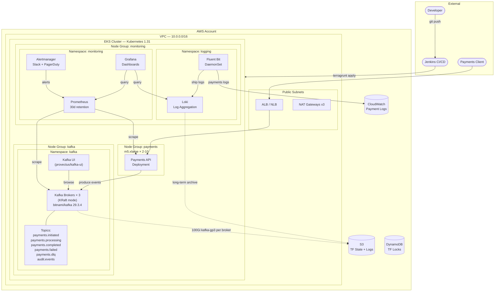

# Payments API — EKS + Kafka + Monitoring CI/CD

Terragrunt-managed infrastructure for the Payments API: AWS EKS cluster, Apache Kafka (KRaft mode via Helm), Prometheus/Grafana monitoring, and centralized Loki/Fluent Bit logging. Deployed via a Jenkins pipeline with environment-gated approvals.

> **Kafka pattern reference:** [kafka-zero-to-hero](https://github.com/iam-veeramalla/kafka-zero-to-hero) — KRaft mode, topic-per-event-type, producer/consumer patterns.

---

## Architecture Diagram



### Traffic & Data Flows

| Flow | Path |
|------|------|
| Payment initiated | Client → ALB → Payments API → `payments.initiated` topic (12 partitions) |
| Payment processed | Consumer → `payments.processing` → `payments.completed` or `payments.failed` |
| Dead-letter | Failed after retries → `payments.dlq` (90-day retention) |
| Audit trail | All state changes → `audit.events` (1-year retention, compact+delete) |
| Metrics | Kafka JMX + app `/metrics` → Prometheus → Grafana |
| Logs | All pods → Fluent Bit → Loki (90d) + CloudWatch (payment pods) |
| Alerts | Consumer lag > 10k → Slack; > 5k on payments → PagerDuty |

---

## File Structure

```
examples/eks-confluent-kafka/
├── README.md                          # This file
├── jenkins/
│   └── Jenkinsfile                    # Parameterised CI/CD pipeline
├── scripts/
│   ├── prereqs.sh                     # Install all local tools
│   ├── bootstrap.sh                   # Create S3 bucket + DynamoDB table
│   └── verify-kafka.sh                # Smoke-test Kafka after deploy
├── modules/                           # Reusable Terraform modules
│   ├── eks/
│   │   ├── main.tf                    # VPC + EKS cluster + IRSA roles
│   │   ├── variables.tf
│   │   └── outputs.tf
│   ├── kafka/
│   │   ├── main.tf                    # StorageClass, NetworkPolicy, Helm: bitnami/kafka + kafka-ui + topic jobs
│   │   ├── variables.tf
│   │   └── outputs.tf
│   ├── monitoring/
│   │   ├── main.tf                    # Helm: kube-prometheus-stack + PrometheusRules
│   │   └── variables.tf
│   └── logging/
│       ├── main.tf                    # Helm: Loki + Fluent Bit + S3 lifecycle
│       └── variables.tf
└── terragrunt/
    ├── terragrunt.hcl                 # Root: remote state, provider generation
    └── live/
        ├── aws/
        │   ├── eks/terragrunt.hcl     # EKS cluster + node groups
        │   ├── kafka/terragrunt.hcl   # Kafka + topics (depends on eks)
        │   ├── monitoring/terragrunt.hcl # Prometheus/Grafana (depends on eks)
        │   └── logging/terragrunt.hcl # Loki/Fluent Bit (depends on eks)
        └── azure/
            ├── aks/terragrunt.hcl     # (AKS equivalent)
            ├── kafka/terragrunt.hcl
            └── monitoring/terragrunt.hcl
```

---

## Why This Architecture

| Problem | Solution |
|---------|----------|
| Payment events lost on API crash | Kafka durable log — events persist independently of producers |
| Coupled payment services | Kafka topics decouple initiation, processing, and notification |
| Spike handling (Black Friday) | Kafka buffers burst; EKS autoscaler adds consumers |
| Audit compliance | `audit.events` topic with 1-year retention, compact+delete, shipped to S3 Glacier |
| Failed payment visibility | `payments.dlq` topic captures retried failures for manual review |
| Consumer lag alerting | PrometheusRule fires to PagerDuty when lag > 5k on payment topics |
| Broker storage I/O bottleneck | kafka-gp3 StorageClass: 6000 IOPS, 250 MiB/s, encrypted gp3 EBS |
| Unauthorized broker access | NetworkPolicy: only payments namespace + monitoring reach Kafka |

---

## Step-by-Step Setup Guide

### Prerequisites

| Tool | Version | Install |
|------|---------|--------|
| Terraform | 1.9+ | `bash scripts/prereqs.sh` |
| Terragrunt | 0.67+ | `bash scripts/prereqs.sh` |
| AWS CLI | v2 | `bash scripts/prereqs.sh` |
| kubectl | 1.31+ | `bash scripts/prereqs.sh` |
| Helm | 3.16+ | `bash scripts/prereqs.sh` |
| checkov | latest | `bash scripts/prereqs.sh` |

Run once to install everything:

```bash
bash scripts/prereqs.sh
```

---

### Step 1 — Configure AWS Credentials

```bash
# Option A: Named profile (recommended)
aws configure --profile payments-api
export AWS_PROFILE=payments-api

# Option B: IAM role assumption (CI/CD)
aws sts assume-role \
  --role-arn arn:aws:iam::ACCOUNT_ID:role/payments-deployer \
  --role-session-name local-deploy \
  --query 'Credentials' --output json

# Verify
aws sts get-caller-identity
```

Required IAM permissions for the deploy role:

```json
{
  "Version": "2012-10-17",
  "Statement": [
    {
      "Effect": "Allow",
      "Action": [
        "eks:*", "ec2:*", "iam:*", "s3:*",
        "dynamodb:*", "autoscaling:*", "elasticloadbalancing:*",
        "logs:*", "cloudwatch:*"
      ],
      "Resource": "*"
    }
  ]
}
```

---

### Step 2 — Bootstrap Remote State

Run once per AWS account before any `terragrunt apply`:

```bash
bash scripts/bootstrap.sh
```

This creates:
- S3 bucket: `payments-api-tfstate-<account-id>` (versioned, encrypted, public access blocked)
- DynamoDB table: `payments-api-tf-locks` (state locking)

---

### Step 3 — Deploy EKS Cluster

```bash
cd terragrunt/live/aws/eks

terragrunt init
terragrunt plan        # review: VPC, 3 node groups, IRSA roles
terragrunt apply
```

Expected: ~15 minutes. Creates VPC (3 AZs), EKS 1.31, node groups (payments, kafka, monitoring), EBS CSI, cluster autoscaler.

Update kubeconfig:

```bash
aws eks update-kubeconfig \
  --name payments-api-eks \
  --region us-east-1
kubectl get nodes
```

---

### Step 4 — Deploy Kafka

```bash
cd ../kafka

terragrunt init
terragrunt plan        # review: StorageClass kafka-gp3, NetworkPolicy, 3 brokers, kafka-ui, 6 topics
terragrunt apply
```

Expected: ~10 minutes. Creates:
- `kafka-gp3` StorageClass (6000 IOPS, 250 MiB/s, encrypted, Retain)
- NetworkPolicy restricting broker access to `payments` and `monitoring` namespaces
- Kafka in KRaft mode (no ZooKeeper), 3 brokers × 100Gi each
- Kafka UI for topic/consumer group visibility
- All 6 payment topics with per-topic retention and cleanup policy

Verify:

```bash
bash scripts/verify-kafka.sh
```

Access Kafka UI:

```bash
kubectl port-forward -n kafka svc/kafka-ui 8080:80
# Open http://localhost:8080
```

---

### Step 5 — Deploy Monitoring

```bash
cd ../monitoring

terragrunt init
terragrunt plan
terragrunt apply
```

Expected: ~5 minutes. Deploys Prometheus (30d retention), Grafana, Alertmanager with Slack + PagerDuty.

Access Grafana:

```bash
kubectl port-forward -n monitoring svc/kube-prometheus-stack-grafana 3000:80
# Open http://localhost:3000 — admin / (password from SSM or terraform output)
```

Pre-built dashboards available:
- Kafka Overview (ID: 7589)
- Kafka Consumer Groups (ID: 11973)
- Kubernetes Cluster (ID: 6417)

---

### Step 6 — Deploy Logging

```bash
cd ../logging

terragrunt init
terragrunt plan
terragrunt apply
```

Expected: ~5 minutes. Deploys Loki + Fluent Bit DaemonSet. Logs viewable in Grafana → Explore → Loki datasource.

Query payment logs:
```logql
{namespace="payments"} |= "payment_id"
```

---

### Step 7 — Configure Jenkins Pipeline

1. In Jenkins → **New Item** → **Pipeline**
2. Set **Pipeline script from SCM** → point to this repo
3. Set **Script Path:** `examples/eks-confluent-kafka/jenkins/Jenkinsfile`
4. Add credentials:
   - `aws-role-arn-dev` — IAM Role ARN for dev
   - `aws-role-arn-staging` — IAM Role ARN for staging
   - `aws-role-arn-production` — IAM Role ARN for production
   - `slack-webhook` — Slack webhook URL
5. Run with parameters:
   - **CLOUD:** `aws`
   - **ENVIRONMENT:** `dev`
   - **COMPONENT:** `all`

Pipeline stages: Validate → Checkout → Setup Tools → Authenticate → Init → Validate Config → Plan → **Approval** (prod/staging) → Apply → Verify Infrastructure → **Verify Kafka Installation**

The **Verify Kafka Installation** stage runs 6 checks (only when COMPONENT=all or kafka):
1. All 3 broker pods Ready
2. KRaft controller quorum leader elected
3. All 6 payment topics present
4. Partition counts and ISR verified per topic
5. Produce + consume round-trip smoke test on `payments.initiated`
6. JMX metrics endpoint returning Kafka series

---

### Step 8 — Deploy All at Once (Run-All)

For a fresh environment, deploy all components in dependency order:

```bash
cd terragrunt/live/aws

# Dry run
terragrunt run-all plan --terragrunt-non-interactive

# Apply (EKS first, then kafka/monitoring/logging in parallel)
terragrunt run-all apply --terragrunt-non-interactive
```

---

## Kafka Topic Reference

| Topic | Partitions | Retention | Cleanup Policy | Purpose |
|-------|-----------|-----------|----------------|---------|
| `payments.initiated` | 12 | 7 days | delete | New payment requests |
| `payments.processing` | 12 | 7 days | delete | In-flight payments |
| `payments.completed` | 12 | 30 days | delete | Successful payments |
| `payments.failed` | 6 | 30 days | delete | Failed payments |
| `payments.dlq` | 3 | 90 days | delete | Dead-letter queue |
| `audit.events` | 6 | 365 days | compact,delete | Compliance audit trail |

---

## Monitoring & Alerts

| Alert | Threshold | Severity | Destination |
|-------|-----------|----------|-------------|
| `KafkaConsumerLagHigh` | lag > 10,000 | warning | Slack |
| `KafkaBrokerDown` | broker unreachable > 1m | critical | PagerDuty |
| `PaymentProcessingDelayed` | payment topic lag > 5,000 | critical | PagerDuty |

---

## Useful Commands

```bash
# Kafka producer (test payment event)
kubectl exec -n kafka kafka-broker-0 -- \
  kafka-console-producer.sh \
  --bootstrap-server kafka.kafka.svc.cluster.local:9092 \
  --topic payments.initiated

# Kafka consumer (read from beginning)
kubectl exec -n kafka kafka-broker-0 -- \
  kafka-console-consumer.sh \
  --bootstrap-server kafka.kafka.svc.cluster.local:9092 \
  --topic payments.initiated \
  --from-beginning

# Consumer group lag (all groups)
kubectl exec -n kafka kafka-broker-0 -- \
  kafka-consumer-groups.sh \
  --bootstrap-server kafka.kafka.svc.cluster.local:9092 \
  --describe --all-groups

# KRaft controller quorum health
kubectl exec -n kafka kafka-broker-0 -- \
  kafka-metadata-quorum.sh \
  --bootstrap-server kafka.kafka.svc.cluster.local:9092 \
  describe --status

# Describe a topic (check partitions and ISR)
kubectl exec -n kafka kafka-broker-0 -- \
  kafka-topics.sh \
  --bootstrap-server kafka.kafka.svc.cluster.local:9092 \
  --describe --topic payments.initiated

# Kafka UI — visual topic browser and consumer group monitor
kubectl port-forward -n kafka svc/kafka-ui 8080:80
# Open http://localhost:8080

# Grafana port-forward
kubectl port-forward -n monitoring svc/kube-prometheus-stack-grafana 3000:80

# Prometheus port-forward
kubectl port-forward -n monitoring svc/kube-prometheus-stack-prometheus 9090:9090

# Loki log query (via Grafana)
kubectl port-forward -n logging svc/loki 3100:3100

# Tear down single component
cd terragrunt/live/aws/kafka && terragrunt destroy

# Tear down everything
cd terragrunt/live/aws && terragrunt run-all destroy --terragrunt-non-interactive
```

---

## Troubleshooting

| Symptom | Cause | Fix |
|---------|-------|-----|
| Kafka pod `Pending` | Kafka node group not ready or taint mismatch | Check `kubectl describe pod -n kafka <pod>` for taint/toleration |
| Topic create job fails | Kafka not yet ready | Increase `backoff_limit` in topic job or rerun `terragrunt apply` |
| Consumer lag alert firing | Slow consumer or undersized consumer | Scale consumer deployment; check `payments.processing` lag |
| KRaft leader election fails | Clock skew > 2s between nodes | Sync NTP on worker nodes; restart controller pods |
| Kafka UI shows no brokers | Kafka service DNS not resolving | Verify `kafka.kafka.svc.cluster.local:9092` from kafka-ui pod |
| Grafana datasource missing | Loki not deployed or wrong URL | Verify `loki.logging.svc.cluster.local:3100` is reachable |
| `terragrunt init` 403 | Missing S3/DynamoDB permissions | Verify IAM role has S3+DynamoDB access; run `bootstrap.sh` first |
| EBS volume stuck `Pending` | EBS CSI driver not installed or StorageClass missing | Verify `kafka-gp3` StorageClass and `aws-ebs-csi-driver` addon |
| ISR < min.insync.replicas | Broker overloaded or network partition | Check broker JVM heap; scale node group if CPU/mem saturated |
